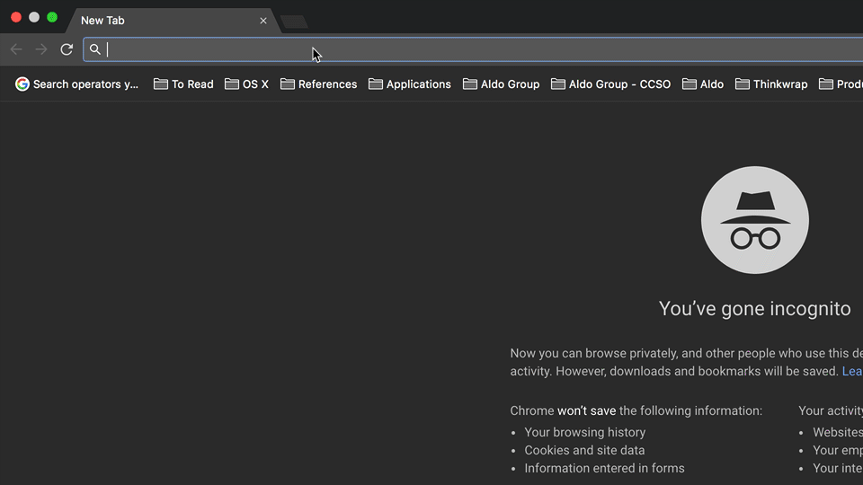

# Issue: Visa Checkout SDK modifies browser history

**Walkthrough**: https://youtu.be/Jf8cwjUnI_E

**Ticket No.**: 1-883230918

### Steps to Reproduce

1. Clone this repo
   ```
   git clone git@github.com:seanpoulter/visa-checkout--ticket-1-883230918
   cd visa-checkout--ticket-1-883230918
   ```
1. Create a new file called in the repo directory called **env.js** that declares your Client ID and API key:
   ```js
   var CLIENT_ID = ;
   var API_KEY = ;
   ```
1. Open Chrome
1. Install the [Web Server for Chrome](https://chrome.google.com/webstore/detail/web-server-for-chrome/ofhbbkphhbklhfoeikjpcbhemlocgigb)
1. Open the Web Server for Chrome app
1. Choose the folder containing the repo
1. Click the link to open the locally served folder
1. Click the four buttons to reproduce the issue

### Expected Result

The cart overlay is not added to the browser history

### Actual Result

The cart overlay is added to the browser history twice:


